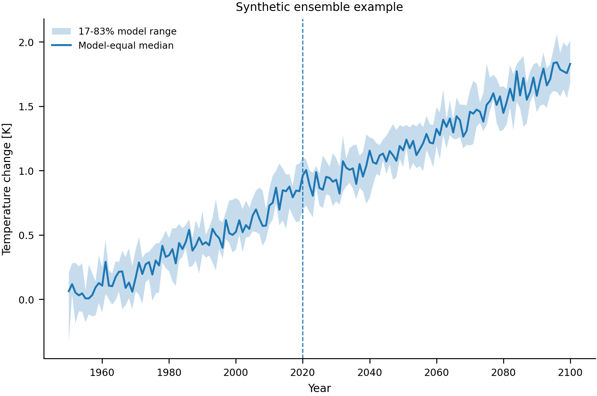

# IPCC-WG1 Scientific Plotting Skill

A compact, reproducible toolkit for publication-quality climate-science figures, distilled from public IPCC AR6 Working Group I workflows.

> [!IMPORTANT]
> This is an independent project. It is not an official IPCC product and does not imply IPCC endorsement.

## Features

* Model-equal ensemble summaries with configurable quantile intervals
* Grid-cell sample counts and sign-agreement diagnostics
* Benjamini–Hochberg false-discovery-rate control
* Publication-sized Matplotlib contexts and PDF/PNG export
* Area-aware spatial aggregation and low-agreement hatching
* YAML-based figure recipes
* Input hashing, environment capture, and figure provenance
* Tests and an end-to-end synthetic example

## Installation

Python 3.11 or later is required.

```bash
python -m venv .venv
source .venv/bin/activate          # Windows: .venv\Scripts\activate
python -m pip install -e ".[qa]"
```

Install the optional climate-analysis stack:

```bash
python -m pip install -e ".[climate,qa,workflow]"
```

## Quick start

Run the included workflow:

```bash
python examples/quickstart.py
```

It creates:

* `outputs/quickstart.pdf`
* `outputs/quickstart.png`
* `outputs/quickstart_plotted_data.nc`
* `outputs/quickstart.provenance.json`



Minimal API example:

```python
import xarray as xr

from ipcc_sciplot import ensemble_summary, publication_context, save_figure

ensemble = xr.open_dataarray("ensemble.nc")

summary = ensemble_summary(
    ensemble,
    dim="model",
    lower_q=0.17,
    upper_q=0.83,
    sign_agreement=0.80,
    min_count=5,
)

with publication_context(width="double"):
    # Build the figure from summary["center"], summary["lower"],
    # summary["upper"], summary["sign_agreement"], and summary["n_valid"].
    ...
```

## Workflow

```text
Scientific question
→ Figure contract
→ Data validation
→ Explicit statistical transformation
→ Compact plotted-data artifact
→ Declarative visual encoding
→ PDF/PNG export
→ Provenance, tests, and citations
```

A starter configuration is available at [`templates/figure_recipe.yaml`](templates/figure_recipe.yaml).

## Project structure

```text
examples/                End-to-end example
outputs/                 Reference outputs
references/              Statistical and visual-encoding guidance
scripts/ipcc_sciplot/    Reusable Python package
scripts/check_figure.py  Static artifact preflight
templates/               Figure-recipe templates
tests/                   Unit tests
SKILL.md                  Full methodology and operating instructions
```

## Validation

```bash
pytest

python scripts/check_figure.py \
  outputs/quickstart.pdf \
  --metadata outputs/quickstart.provenance.json
```

## Design principles

1. Define the scientific estimand before choosing the visual form.
2. Keep data transformation separate from visual encoding.
3. Report uncertainty, model agreement, and valid sample count explicitly.
4. Export plotted data alongside each final figure.
5. Record inputs, parameters, software versions, and Git state.

Detailed statistical rules and visual conventions are documented in [`references/`](references/). The source distillation and upstream references are listed in [`references/ipcc_wg1_distillation.md`](references/ipcc_wg1_distillation.md) and [`references/SOURCES.md`](references/SOURCES.md).

## Scope

The toolkit is intended for climate-model evaluation, multi-model ensemble analysis, regional assessments, extremes analysis, and reproducible report or journal figures.

Project-specific scientific choices—including ensemble construction, weighting, baselines, significance tests, agreement thresholds, projections, and colour scales—remain the responsibility of the analyst.
