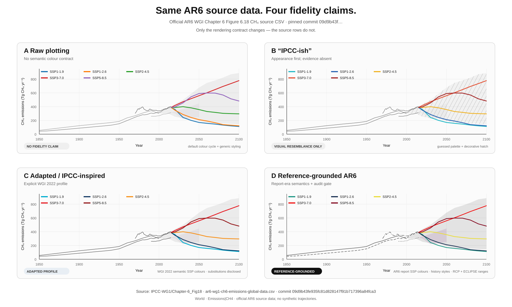

# ipcc-wg1-scientific-plotting-skill

**Python helpers for IPCC AR6 WGI scientific plots, source-backed reproductions, and automated figure checks.**

## Install

~~~bash
python -m pip install ar6-sciplot
~~~

The distribution is `ar6-sciplot`; the Python package is `ipcc_sciplot`.

For map and climate workflows:

~~~bash
python -m pip install "ar6-sciplot[climate]"
git clone https://github.com/IPCC-WG1/colormaps.git
export IPCC_WG1_COLORMAPS_DIR=/path/to/colormaps
~~~

## Quick example

~~~python
import matplotlib.pyplot as plt

from ipcc_sciplot import audit_figure, axis_label, publication_context, scenario_style

style = scenario_style("SSP2-4.5", profile="ar6-report")

with publication_context(width="double", strict_font=False):
    fig, ax = plt.subplots()
    ax.plot(
        [2020, 2040, 2060, 2080, 2100],
        [1.2, 1.5, 1.8, 2.0, 2.2],
        color=style.color,
        label="SSP2-4.5",
    )
    ax.set_xlabel("Year")
    ax.set_ylabel(axis_label("Temperature change", "°C"))
    ax.legend()

print(
    audit_figure(
        fig,
        profile="ar6-report",
        strict_dimensions=True,
    )
)
plt.show()
~~~

## AR6 source-data comparison

The four panels use the same official AR6 WGI Chapter 6 Figure 6.18 methane-emissions
source data. The dataset is pinned to commit
`09d9b43fe935fc81d828147f91b717396a84fca3` in
`IPCC-WG1/Chapter-6_Fig18`.

The figure includes historical series, the RCP range, the ECLIPSE range, and five
core SSPs. Rebuild or verify it with:

~~~bash
python examples/visual_comparison.py
python examples/visual_comparison.py --check
~~~

## Cross-library benchmark

Figanos 0.7.0 is the stronger general-purpose climate plotting package: broader plot
coverage, deeper Xarray integration, native faceting, automatic scenario colours, and
bundled IPCC colormaps.

ar6-sciplot focuses on AR6/WGI profile versioning, print geometry, provenance,
uncertainty semantics, and figure checks. The benchmark runs both packages on the same
scenario data and controlled map inputs.

- [benchmark methodology](benchmarks/ipcc_plotting/README.md)
- [latest recorded results](benchmarks/ipcc_plotting/RESULTS.md)
- [benchmark workflow](.github/workflows/plotting-benchmark.yml)

## Reference reproductions

### Chapter 6 — Figure 6.18 source

  

~~~text
source      IPCC-WG1/Chapter-6_Fig18 @ 09d9b43f…
canvas      180 × 92 mm
raster      350 ppi
profile     ar6-report
regression  pinned source + SHA256 manifest
~~~

<table>
<tr>
<td width="50%" valign="top">
<strong>Chapter 3 — Figure 3.2b</strong> 
Scatter + fitted relationship from the Chapter 3 source CSV.  

</td>
<td width="50%" valign="top">
<strong>Chapter 10 — Figure 10.20b</strong> 
Mediterranean station map from the WGI ESMValTool station files.  

</td>
</tr>
</table>

<strong>Chapter 2 — Figure 2.3 paleo CO₂ reconstruction</strong>

 

Source commits, output dimensions, hashes, and regeneration commands are in the
[reference gallery](examples/ipcc_reference/README.md) and
[manifest](examples/ipcc_reference/outputs/manifest.json).

## Figure audit

`ar6plot` runs the checks used by the Python API from the command line.

A figure script exposes a zero-argument function returning a Matplotlib `Figure`:

~~~python
def make_figure():
    ...
    return fig
~~~

Run the audit:

~~~bash
ar6plot audit examples/audit_demo.py --strict-dimensions
~~~

Example output:

~~~text
AR6 fidelity audit — PASS
Profile: ar6-report

PASS  text.unit-convention
PASS  delivery.width
PASS  delivery.height
PASS  scenario.color.0.0
PASS  scenario.color.0.1
PASS  scenario.color.0.2

Summary: 6 passed, 0 failed
~~~

JSON output is available for CI:

~~~bash
ar6plot audit examples/audit_demo.py \
  --strict-dimensions \
  --format json \
  --output outputs/audit.json
~~~

Reference geometry can be checked from the same command:

~~~bash
ar6plot audit figure.py \
  --reference-size-mm 180 92 \
  --reference-panel-count 3 \
  --reference-projection Robinson
~~~

Exit codes: `0` pass, `1` failed checks, `2` audit error.

The Python API exposes both the compatibility function and the structured report:

~~~python
from ipcc_sciplot import audit_figure, audit_figure_report

issues = audit_figure(fig)
report = audit_figure_report(fig, strict_dimensions=True)

print(report.passed)
print(report.to_dict())
~~~

## Profiles

| Profile | Use |
| --- | --- |
| `ar6-report` | Final-report-era AR6 colours and conventions |
| `wgi-guide-2022` | June 2022 WGI visual guidance |

The package includes:

- SSP and RCP semantic colours
- official WGI colormap loading
- 90 mm and 180 mm publication widths
- 250 mm maximum figure height
- 350 ppi raster output
- axis-label and unit helpers
- uncertainty and significance layers
- uncertainty legends and fixed-size panel grids
- provenance helpers
- delivery and reference-geometry audits
- pinned source-data regression examples

Detailed rules live in:

- [source corpus](references/SOURCES.md)
- [evidence matrix](references/evidence_matrix.md)
- [visual grammar](references/ipcc_visual_grammar.md)
- [figure archetypes](references/figure_archetypes.md)
- [fidelity checklist](references/fidelity_checklist.md)
- [statistical rules](references/statistical_rules.md)

## Repository layout

~~~text
scripts/ipcc_sciplot/
├── tokens.py
├── colormaps.py
├── style.py
├── archetypes.py
├── maps.py
├── fidelity.py
├── uncertainty.py
└── provenance.py

examples/
├── quickstart.py
├── audit_demo.py
├── visual_comparison.py
└── ipcc_reference/
~~~

## Development

~~~bash
python -m pip install -e ".[qa]"
ruff check .
pytest -q
python examples/quickstart.py
python examples/visual_comparison.py --check
~~~

The reference workflow rebuilds the four source-data examples and fails if the
committed outputs drift.

## License and upstream material

Project code and documentation are licensed under the [MIT License](LICENSE).

IPCC figures, datasets, colour assets, chapter code, fonts, and other upstream
material keep their original terms. See
[THIRD_PARTY_NOTICES.md](THIRD_PARTY_NOTICES.md) and
[references/SOURCES.md](references/SOURCES.md).

This is an independent project and is not an official IPCC product.
