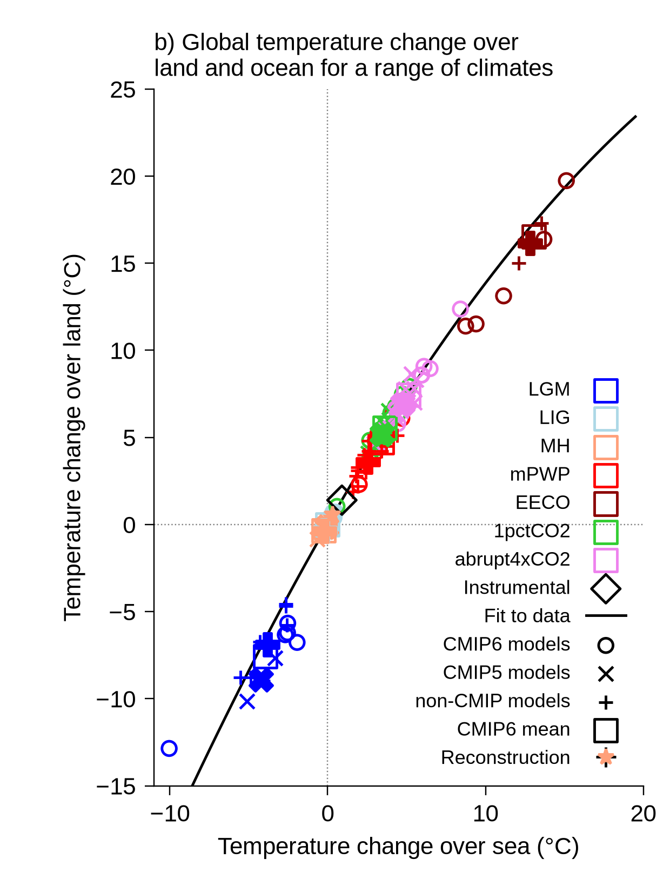
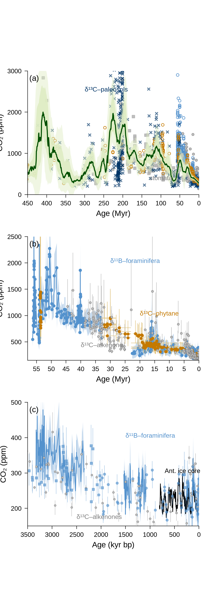
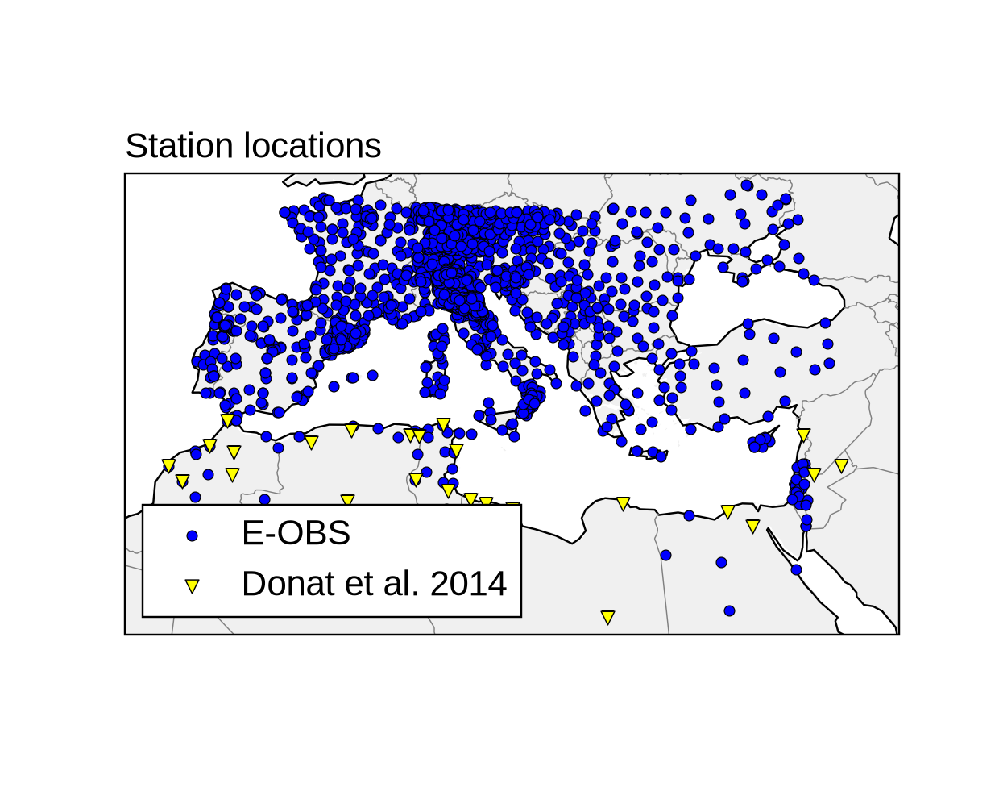
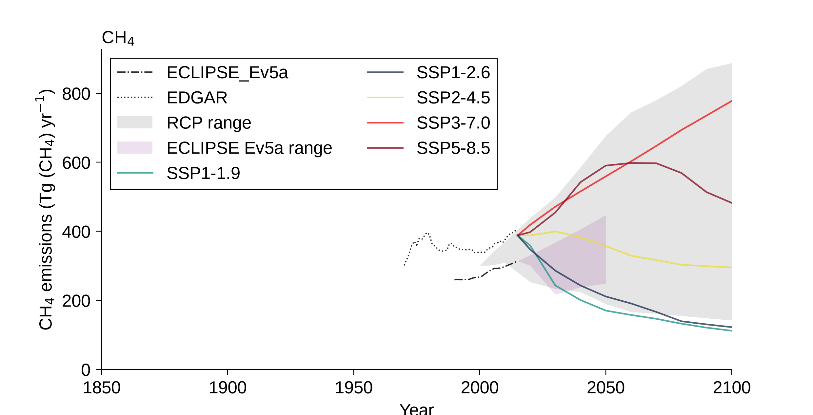

# IPCC AR6 WGI reference gallery

Source-data reproductions built from **pinned official IPCC AR6 WGI repositories**.

These are regression references for this skill, not official IPCC graphics. Each reproduction fetches upstream data from a fixed Git commit, applies the corresponding figure-family grammar, exports at IPCC physical delivery size, and records SHA256 provenance in `outputs/manifest.json`.

## Gallery

### Chapter 3 — Figure 3.2b

Scatter + fitted relationship using the official Chapter 3 CSV source data.



- Source: `IPCC-WG1/Chapter-3_Fig02b`
- Commit: `ee22b6221c6535f81a33c1b033a4183621df0b23`
- Output: 90 × 120 mm at 350 ppi
- SHA256: `2be39af9b3fc640e303f55715e9ce278989a4299cf5ed46f8c0f7f7b7093b0f4`

### Chapter 2 — Figure 2.3

Three-panel paleo CO₂ proxy reconstruction with uncertainty bands, error bars, multiple proxy families and temporal scales.



- Source: `IPCC-WG1/Chapter-2_Fig03`
- Commit: `5078755d5bf97653ae498f204bc55aeaf13b1671`
- Output: 90 × 240 mm at 350 ppi
- SHA256: `3a364dda3b3e4f1b2933ee6a322101daa9b30a17b229e43db549ecea8eab43e4`

### Chapter 10 — Figure 10.20b

Mediterranean station-location map using the official WGI ESMValTool station files and Lambert Conformal projection.



- Source: `ipcc-wgi/ESMValTool-AR6-OriginalCode-FinalFigures`
- Commit: `91845e70e46bb5581d5612ac34256b44106bfb3d`
- Output: 90 × 72 mm at 350 ppi
- SHA256: `01589a73fc574ebe8e23261b01ced81276ec7aacb56a33d82c3c7ea3bc15fb09`

### Chapter 6 — Figure 6.18 source

Historical + scenario methane-emissions time series using the official Chapter 6 global-emissions CSV.



- Source: `IPCC-WG1/Chapter-6_Fig18`
- Commit: `09d9b43fe935fc81d828147f91b717396a84fca3`
- Output: 180 × 92 mm at 350 ppi
- SHA256: `9403dd0c33c377c8dcb6ab1a6e1b8ce115af70bd4b856c1b98b4ca46132c9025`

## Reproduce

```bash
python -m pip install -e ".[qa]"
python -m pip install cartopy
python examples/ipcc_reference/generate_all.py
```

Network access is required. The scripts deliberately fetch the source data from pinned upstream commits instead of vendoring copies.

## Verification

The reproduction workflow checks:

- Ruff
- successful generation of all four figure families
- 90 / 180 mm physical-width contracts
- 350 ppi output
- output pixel dimensions
- SHA256 manifest generation
- GitHub Actions artifact creation

Expected pixel dimensions at 350 ppi:

| Figure | Canvas | Pixels |
| --- | ---: | ---: |
| Chapter 3 Figure 3.2b | 90 × 120 mm | 1240 × 1653 |
| Chapter 2 Figure 2.3 | 90 × 240 mm | 1240 × 3307 |
| Chapter 10 Figure 10.20b | 90 × 72 mm | 1240 × 992 |
| Chapter 6 Figure 6.18 source | 180 × 92 mm | 2480 × 1267 |

## Typography boundary

Arial is not redistributed by this repository. CI therefore uses the documented sans-serif fallback when Arial is unavailable. Source data, geometry, semantic colours and figure-family grammar are still regression-tested.

For a render to be called **strictly IPCC-faithful**, install Arial and run the strict font audit locally.

## Provenance

Machine-readable source commits and output SHA256 values live in:

`outputs/manifest.json`
